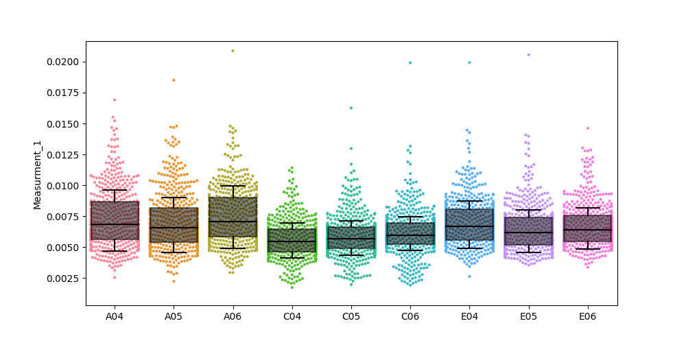
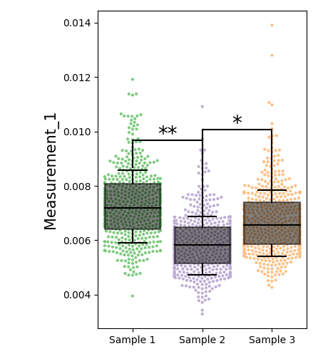

## CytView is a python library which has been developed to handle high-throughout single cell imaging datasets generated from software such as CellProfiler. 


<br><br>

### A jupyter notebook (example.ipynb) and example dataset (dataset/experiment.csv) has been included within this repository to assist with ease-of-use.

<br>

## Installation:
CytView can currently be installed directly from github using PIP.  
```python
pip install git+https://github.com/charliebidgood/CytView
```

<br>

## API Reference:
<br>

### Example: experiment.csv (first 5 rows):


| ImageNumber | ObjectNumber | Metadata_Well | Measurement_1 | Measurement_2 |
|-------------|--------------|---------------|---------------|---------------|
| 1           | 1            | A04           | 0.008474807   | 0.169154055   |
| 1           | 2            | A04           | 0.01052627    | 0.114010939   |
| 1           | 3            | A04           | 0.006294804   | 0.05234771    |
| 1           | 4            | A04           | 0.006413796   | 0.006516079   |
| 1           | 5            | A04           | 0.005213105   | 0.059943293   |

<br>

##  cytview.cell_plot()

Randomly sample a subset of single-cell observations and plot cell-by-cell values CytView makes use of seaborn's swarmplot() and boxplot() functions and thus any plot-related parameters can be tweaked using matplotlib.


```python
cytview.cell_plot(dataframe, measurement, identifier, obs_max = 500, color="Accent")
```

*dataframe (pd.DataFrame): Pandas DataFrame object containing cell-by-cell measurements and group identifiers.* 

*measurement (string): DataFrame column name containing the measurement of interest. In the case of experiment.csv, this would be "Measurement_1".*

*identifier (string): DataFrame column name containing the identifier which aggregates each cell into an experimental group. In the case of experiment.csv, this would be "Metadata_Well" which represents what well of a 96-well plate that a cell belongs to*

*obs_max (int): Number of observations per group to randomly sample (default 500)*

*color: Matplotlib or seaborn color palette (default "Accent"). You can also define custom colors with sns.set_palette(sns.color_palette([colors]))*

cell_plot() also returns a dictionary containing the down-sampled dataframe which can be called with cell_plot()["dataframe"] and a data summary which can be called with cell_plot()["summary"]


Example Output:



<br>
<br>

##  cytview.group_plot()
Sample single-cell observations, group samples as experimental replicates and perform comparative statistics to determine significance.

```python
cytview.group_plot(dataframe, measurment, identifier, groupings, labels, obs_max = 500, color="Accent", compare=None, draw=False)
```

*dataframe (pd.DataFrame): Pandas DataFrame object containing cell-by-cell measurements and group identifiers.* 

*measurement (string): DataFrame column name containing the measurement of interest. In the case of experiment.csv, this would be "Measurement_1".*

*identifier (string): DataFrame column name containing the identifier which aggregates each cell into an experimental group. In the case of experiment.csv, this would be "Metadata_Well" which represents what well of a 96-well plate that a cell belongs to*

*groupings (list of lists): Lists of identifier strings which contain the groupings for experimental (technical) replicates. Example of grouping definitions is contained within example.ipynb*

*labels (list): List of labels to rename each experimental group. Label each group by order of appearance within the groupings argument. *

*compare (list of lists): Lists of statistical comparisons to make between groupings by index. Example: compare = [[0,1],[1,2]] will perform a One Way ANOVA between columns 1 and 2 as well as columns 2 and 3*

*obs_max (int): Number of observations per group to randomly sample (default 500). Note: the higher obs_max the more computationally demanding the plot function will be*

*color: Matplotlib or seaborn color palette (default "Accent"). You can also define custom colors with sns.set_palette(sns.color_palette([colors]))*

Example output:




<br>
<br>

##  cytview.extract_values()
Make use of CytView's measurement extraction function in order to generate a down-sampled dataset from your input data. This is useful if you wish to independently perform statistical analysis and visualisation with alternate graphing/plotting softwares. 

```python
cytview.extract_values(dataframe, measurement, identifier, obs_max=500)
```


*dataframe (pd.DataFrame): Pandas DataFrame object containing cell-by-cell measurements and group identifiers.* 

*measurement (string): DataFrame column name containing the measurement of interest. In the case of experiment.csv, this would be "Measurement_1".*

*identifier (string): DataFrame column name containing the identifier which aggregates each cell into an experimental group. In the case of experiment.csv, this would be "Metadata_Well" which represents what well of a 96-well plate that a cell belongs to*

*obs_max (int): Number of observations per group to randomly sample (default 500). Note: the higher obs_max the more computationally demanding the plot function will be*


Example output (first 5 rows):

```python

           A04       A05       A06       C04       C05       C06       E04       E05       E06
2954  0.004288  0.003387  0.008706  0.008025  0.006866  0.006618  0.007125  0.005266  0.006731
2676  0.005719  0.004625  0.006905  0.005447  0.004007  0.005801  0.007522  0.004245  0.004388
1993  0.005470  0.007554  0.009259  0.003686  0.008447  0.005912  0.005385  0.005402  0.005988
2504  0.006326  0.006313  0.005011  0.005473  0.006047  0.005629  0.005572  0.006545  0.003686
487   0.006662  0.009883  0.006966  0.006744  0.006802  0.002728  0.006406  0.006283  0.005750
```

